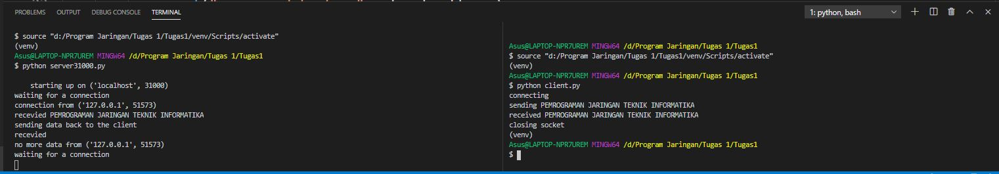
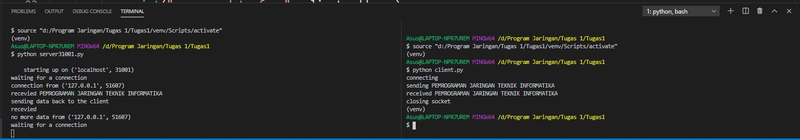
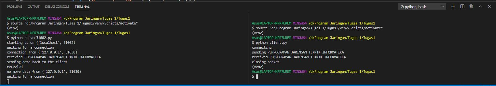

<h1>Tugas 1</h1>

Dibawah ini merupakan dokumentasi program server.py di 3 port yang berbeda (31000,31001,31002)

Dengan menggunakan port 31000 

Dengan menggunakan port 31001 

Dengan menggunakan port 31002 

Untuk ini merupakan dokumentasi program tugas1a

Sebelum menjalankan program tersebut belum adanya file yang tergenerate

Jalankan program server.py dan client.py

Sesudah menjalankan program tersebut maka muncullah file yang baru saja tergenerate

Untuk ini merupakan dokumentasi program tugas1b

Sebelum menjalankan program tersebut belum adanya file yang tergenerate

Jalankan program server.py dan client.py

Sesudah menjalankan program tersebut maka muncullah file yang baru saja tergenerate

