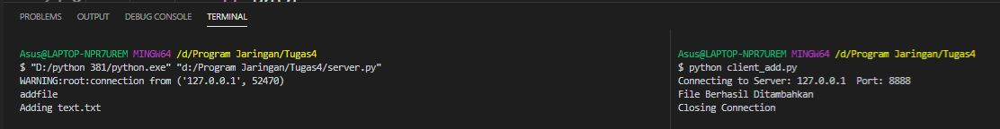

<h1>Tugas 4</h1>

<h2>Protokol</h2>

<h2>Server</h2>

<h2>Kondisi Awal</h2>
file text.txt akan digunakan untuk meletakkan file, sementara file note.txt digunakan untuk mengambil file

<h2>Meletakan File</h2>
Screenshot terminal setelah dijalankan

Screenshot pada folder setelah dijalankan client_add.py, dimana akan tergenerate file baru bernama text.txt pada folder stock

<h2>Mengambil File</h2>
Screenshot terminal setelah dijalankan

Screenshot pada folder setelah dijalankan client_get.py, dimana akan tergenerate file baru note.txt

<h2>Melihat List File</h2>
Screenshot terminal setelah dijalankan client_list.py, file tersebut merupakan file yang berada pada folder stock

<h2>Server Responses</h2>

<h2>Penggunaan JSON</h2>
Untuk JSON saya menggunakannya pada file person_machine.JPG yang berguna untuk menampilkan list file

<h2>Client</h2>
<ol>
  <li>File client untuk addfile <a href="https://github.com/Thalutn5/progjar-b-its-2020/blob/master/Tugas4/client_add.py">client_add.py</a> </li>
  <li>File client untuk getfile <a href="https://github.com/Thalutn5/progjar-b-its-2020/blob/master/Tugas4/client_get.py">client_get.py</a> </li>
  <li>File client untuk listfile <a href="https://github.com/Thalutn5/progjar-b-its-2020/blob/master/Tugas4/client_list.py">client_list.py</a> </li>
</ol>
