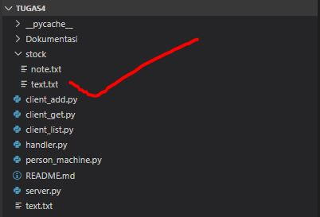
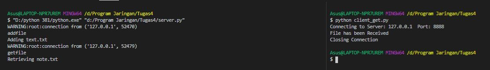

<h1>Tugas 4</h1>

<h2>Protokol</h2>

<h2>Server</h2>

<h2>Kondisi Awal</h2>

<h2>Meletakan File</h2>
Screenshot terminal setelah dijalankan

Screenshot pada folder setelah dijalankan client_add.py

<h2>Mengambil File</h2>
Screenshot terminal setelah dijalankan

Screenshot pada folder setelah dijalankan client_get.py

<h2>Melihat List File</h2>
Screenshot terminal setelah dijalankan client_list.py

<h2>Server Responses</h2>

