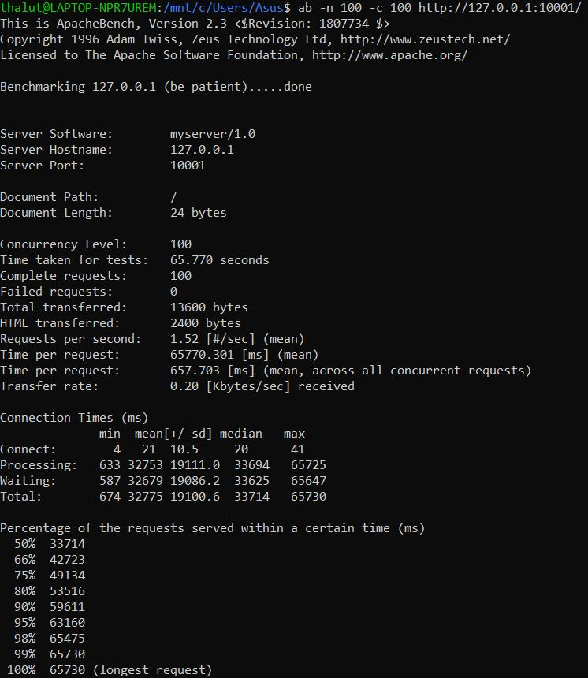

<h1>Tugas 7</h1>
<h2>Benchmark dengan menggunakan request sebanyak 10</h2>
<h3>Concurrency 1</h3>

<h3>Concurrency 5</h3>

<h3>Concurrency 10</h3>

<h2>Benchmark dengan menggunakan request sebanyak 50</h2>
<h3>Concurrency 1</h3>

<h3>Concurrency 10</h3>

<h3>Concurrency 30</h3>

<h3>Concurrency 50</h3>

<h2>Benchmark dengan menggunakan request sebanyak 100</h2>
<h3>Concurrency 1</h3>

<h3>Concurrency 10</h3>

<h3>Concurrency 50</h3>

<h3>Concurrency 100</h3>

<h2>Hasil Performance test</h2>
